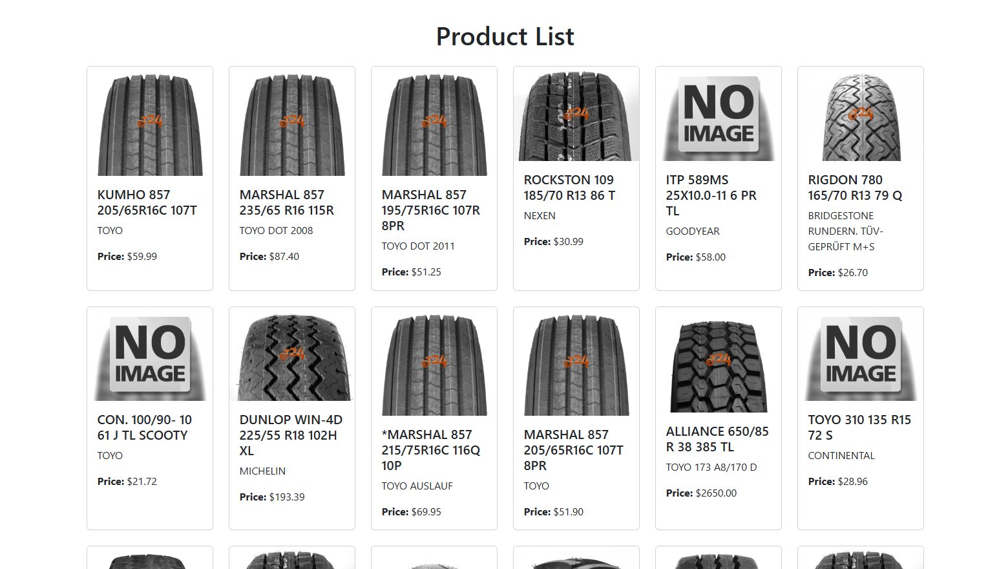

# Product Information Display Module

---
## Objective
To develop a module for a web shop that fetches product data from various sources (e.g., CSV, XML, database) and normalizes it into a unified format. The normalized data should be displayed on a single result page.
## Requirements
- Fetch product data from multiple sources (CSV, XML, database, etc.).
- Normalize data into a consistent format with the following fields: `title`, `description`, `image_link`, `price`
- Display all normalized products on a single result page.
## Challenges
- Handling multiple data sources with different structures.
- Normalizing data with potential inconsistencies in field names and formats.
- Ensuring scalability for additional data sources in the future.
## Priorities
### Data Source Abstraction:
- Abstract different data sources to decouple them from higher-level modules.
- Enable easy integration of new sources (e.g., APIs or customer-specific formats).
### Data Normalization:
- Design a flexible normalization system to unify product data.
- Ensure the system is adaptable for future enhancements, including AI-based techniques.
### Scalability:
- Make connectors and normalization layers modular and extensible to accommodate future needs.
### Error Handling:
- Handle malformed or incomplete data gracefully, ensuring it doesn't disrupt processing.
- Future revisions should incorporate automated data correction during normalization.
## Classes
### 1. `DefaultController`:
- The controller that handles web requests.
- Depends on the `ProductPipeline` to process and retrieve normalized product data.
### 2. `ProductPipeline`:
- Acts as the orchestrator of the system.
- Retrieves data from the `ProductConnectorCollector`, normalizes it using the `ProductNormalizer`, and prepares it for display.
- Manages templates for normalizing data from different connectors.
### 3. `ProductConnectorCollector`:
- Dynamically collects and manages multiple connectors that implement the `ProductConnector` interface.
- Provides an iterable collection of connectors to the `ProductPipeline`.
### 4. `ProductConnector`
Defines the contract using interface class `ProductConnector` and implements the connectors.
- **Implementations:**
  - `ProductConnectorSimulatedDb`: Fetches product data from a simulated database (CSV).
  - `ProductConnectorCsv`: Handles CSV-based product data sources.
  - `ProductConnectorXml`: Processes product data from XML files.
  - `ProductConnectorJson`: Manages product data from JSON files or APIs.
### 5. `ProductNormalizer`
- Defines the contract using interface class `Normalizer` and implements it.
- Uses a configurable template to normalize raw product data into a consistent format.
- Ensures data quality through validation and transformation.

## Class Relationships:
- `DefaultController` depends on `ProductPipeline` for data processing.
- `ProductPipeline` interacts with `ProductConnectorCollector` for fetching raw data and `ProductNormalizer` for normalizing it.
- `ProductConnectorCollector` manually aggregates multiple connectors implementing the `ProductConnector` interface.

## Steps of Development
### 1. Requirement Analysis (60 minutes)
Analyzed the task description and researched tire specifications for better understanding.
### 2. Interface Design (30 minutes)
- Identified challanges and decided on initial priorities.
- Designed a draft class diagram and interfaces for connector and normalization layers.
- Decided to implement normalization as a separate service for flexibility.
### 3. System Setup (10 minutes)
- Created a Symfony skeleton project.
- Configured a `DefaultController` and a Twig templade to render the output as a web page.
### 4. Connector Implementations (20 minutes)
- Implemented initial connectors to test data flow.
- Created the `ProductConnectorCollector` to collect and manage connectors.
### 5. Data Normalization (60 minutes)
- Developed `ProductNormalizer` with a configurable template system.
- Added error handling for flexibility and malformed data.
### 6. Orchestration with `ProductPipeline` (45 minutes)
Built the pipeline to fetch, normalize, and combine data for display.
### 7. Testing (10 minutes)
- Validated functionality with the provided CSV file.
- Tested edge cases, such as malformed rows.
### 8. Class Diagram (5 minutes)
Re-sketched the class diagram using PhpStorm and refined it for clarity
### 9. Writing Report (60 mintues)
Documented the process in detail using Joplin and exported to PDF.

## Total Time Spent
### 5 hours
Includes requirement analysis, system setup, implementation, testing, and documentation.

##
##
##
##
##

## Class Diagram
- `ProductConnector` and `Normalizer` are Interface classes.
- `ProductConnectorCollector` statically manages connectors and could be enhanced with yaml or tag-based autowiring for flexibility.
- `ProductNormalizer` is designed to support advanced features like AI-based information extraction.

